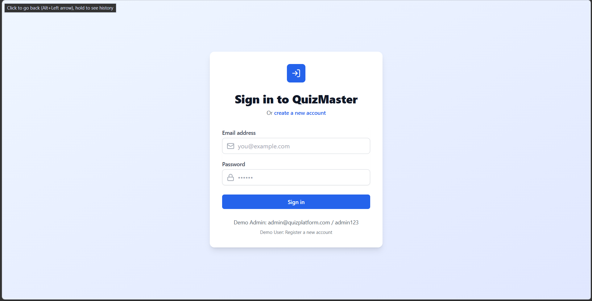
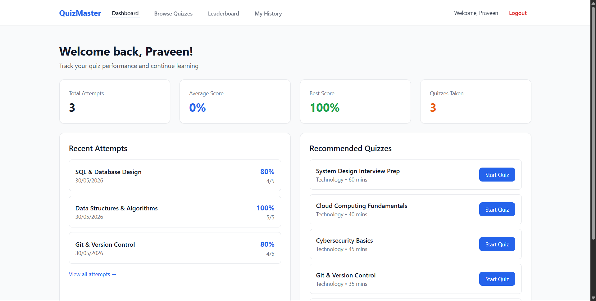
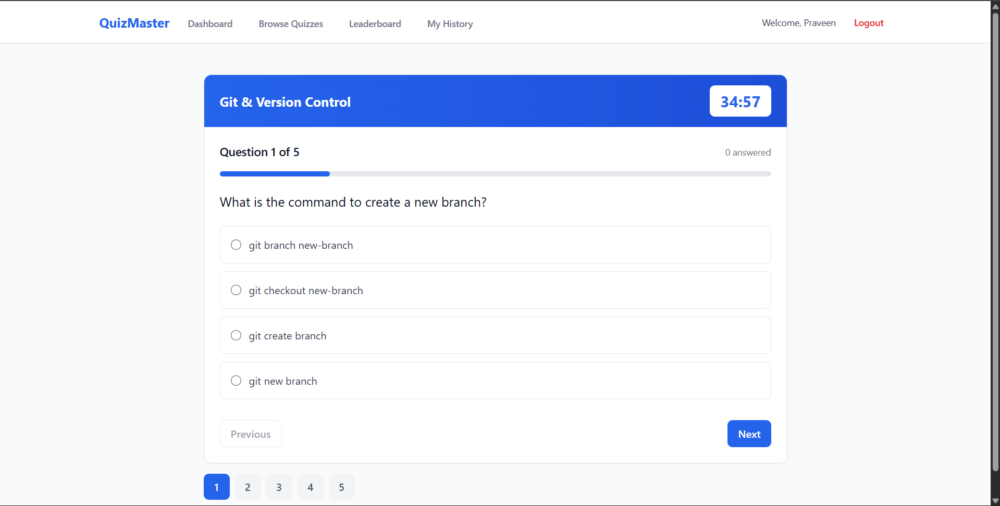
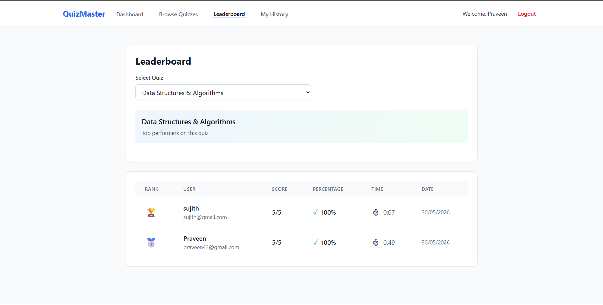

# QuizMaster - Online Quiz & Assessment Platform

A full-featured online quiz platform that allows users to take timed quizzes, track their performance, compete on leaderboards, and provides administrators with complete control over quiz creation and user management.

## 📋 Objective

The primary objective of QuizMaster is to provide an interactive, real-time quiz-taking experience with:
- Seamless authentication and session management
- Role-based access control (User/Admin)
- Real-time quiz attempts with timer functionality
- Automatic scoring and result tracking
- Comprehensive analytics and leaderboards
- Complete administrative control over content

## ✨ Features

### For Users
- **Authentication**: Secure signup, login, and JWT-based authentication with refresh tokens
- **Browse Quizzes**: Search and filter quizzes by category
- **Take Quizzes**: Timed quizzes with question navigation
- **Auto-Scoring**: Instant score calculation and percentage
- **Result Analysis**: Detailed question-by-question review
- **Attempt History**: Track all past quiz attempts
- **Dashboard**: Personal statistics (total attempts, average score, best score)
- **Leaderboard**: Compare performance with other users

### For Admins
- **Quiz Management**: Create, edit, and delete quizzes
- **Question Bank**: Add multiple-choice questions with 4 options each
- **User Management**: View all users and manage roles
- **Analytics Dashboard**: Platform statistics and insights
- **Result Monitoring**: View all quiz attempts across the platform

### Technical Features
- **Responsive Design**: Mobile-friendly interface
- **Real-time Timer**: Countdown timer with auto-submit
- **Token Refresh**: Automatic access token renewal
- **Secure Authentication**: Password hashing with bcrypt
- **RESTful API**: Well-structured backend API

## 🛠️ Tech Stack

### Frontend
| Technology | Version | Purpose |
|------------|---------|---------|
| React | 18.2.0 | UI Library |
| Vite | 5.0.8 | Build Tool |
| Tailwind CSS | 3.3.6 | Styling |
| React Router DOM | 6.20.0 | Routing |
| Axios | 1.6.2 | HTTP Client |
| React Hot Toast | 2.4.1 | Notifications |

### Backend
| Technology | Version | Purpose |
|------------|---------|---------|
| Node.js | 14+ | Runtime |
| Express.js | 4.18.2 | Web Framework |
| MongoDB | 4.4+ | Database |
| Mongoose | 8.0.3 | ODM |
| JWT | 9.0.2 | Authentication |
| bcryptjs | 2.4.3 | Password Hashing |
| express-validator | 7.0.1 | Input Validation |

### Development Tools
- **Nodemon**: Auto-restart during development
- **Postman**: API testing
- **Git**: Version control

## 📁 Project Structure
```
├── backend/
│ ├── src/
│ │ ├── config/
│ │ │ └── db.js
│ │ ├── controllers/
│ │ │ ├── adminController.js
│ │ │ ├── attemptController.js
│ │ │ ├── authController.js
│ │ │ └── quizController.js
│ │ ├── middlewares/
│ │ │ ├── authMiddleware.js
│ │ │ └── errorHandler.js
│ │ ├── models/
│ │ │ ├── Attempt.js
│ │ │ ├── Quiz.js
│ │ │ ├── RefreshToken.js
│ │ │ └── User.js
│ │ ├── routes/
│ │ │ ├── adminRoutes.js
│ │ │ ├── attemptRoutes.js
│ │ │ ├── authRoutes.js
│ │ │ ├── index.js
│ │ │ └── quizRoutes.js
│ │ ├── scripts/
│ │ │ ├── addQuizzes.js
│ │ │ ├── createAdmin.js
│ │ │ └── seedDatabase.js
│ │ ├── utils/
│ │ │ └── tokenUtils.js
│ │ └── server.js
│ ├── .env
│ ├── .gitignore
│ └── package.json
│
├── frontend/
│ ├── src/
│ │ ├── components/
│ │ │ ├── Admin/
│ │ │ │ └── CreateQuizModal.jsx
│ │ │ ├── Layout/
│ │ │ │ └── Layout.jsx
│ │ │ └── Quiz/
│ │ │ └── QuizTaking.jsx
│ │ ├── context/
│ │ │ └── AuthContext.jsx
│ │ ├── pages/
│ │ │ ├── admin/
│ │ │ │ └── AdminDashboard.jsx
│ │ │ ├── auth/
│ │ │ │ ├── Login.jsx
│ │ │ │ └── Register.jsx
│ │ │ └── user/
│ │ │ ├── Dashboard.jsx
│ │ │ ├── Leaderboard.jsx
│ │ │ ├── QuizzesList.jsx
│ │ │ └── Results.jsx
│ │ ├── services/
│ │ │ ├── adminService.js
│ │ │ ├── api.js
│ │ │ ├── attemptService.js
│ │ │ └── quizService.js
│ │ ├── App.jsx
│ │ ├── main.jsx
│ │ └── index.css
│ ├── .env
│ ├── index.html
│ ├── tailwind.config.js
│ ├── vite.config.js
│ ├── .gitignore
│ └── package.json
├──screenshots/
│  ├──login.png
│  ├── dashboard.png
│  ├── quiz.png
│  ├── leaderboard.png
│  └── admin-panel.png
│
└── README.md
```

# 🚀 Installation

## Clone Repository

```bash
git clone https://github.com/Chandrasekhar-5/Online-Quiz-Assessment-Platform.git
cd QuizMaster
```

## Backend Setup

```bash
cd backend

npm install

npm run dev
```

Backend runs on:

```text
http://localhost:5000
```

## Frontend Setup

```bash
cd frontend

npm install

npm run dev
```

Frontend runs on:

```text
http://localhost:5173
```

---

# 🔐 Environment Variables

## Backend (.env)

```env
PORT=5000

MONGODB_URI=mongodb://localhost:27017/quiz_platform

JWT_ACCESS_SECRET=your_access_secret_key_here

JWT_REFRESH_SECRET=your_refresh_secret_key_here

CORS_ORIGIN=http://localhost:5173

NODE_ENV=development
```

## Frontend (.env)

```env
VITE_API_URL=http://localhost:5000/api
```

---

# 🏗️ System Architecture

```text
                   ┌──────────────┐
                   │   Frontend   │
                   │ React + Vite │
                   └──────┬───────┘
                          │
                          │ HTTP Requests
                          │
                   ┌──────▼───────┐
                   │ Backend API  │
                   │ Express.js   │
                   └──────┬───────┘
                          │
         ┌────────────────┼────────────────┐
         │                │                │
         │                │                │
   Authentication     Quiz Logic      Admin System
         │                │                │
         └────────────────┼────────────────┘
                          │
                   ┌──────▼───────┐
                   │   MongoDB    │
                   │   Database   │
                   └──────────────┘
```

---

# 📸 Screenshots

```text
screenshots/

├── login.png

├── dashboard.png

├── quiz.png

├── leaderboard.png

└── admin-panel.png
```

## Login Page

```markdown

```

## Dashboard

```markdown

```

## Quiz Interface

```markdown

```

## Leaderboard

```markdown

```

---


# 🌐 Deployment

| Component | Platform      |
| --------- | ------------- |
| Frontend  | Vercel        |
| Backend   | Render        |
| Database  | MongoDB Atlas |

Deployment Flow:

```text
Frontend (Vercel)

↓

Backend API (Render)

↓

MongoDB Atlas
```

---

# 📡 API Endpoints

## Authentication

| Method | Endpoint | Description | Access |
|--------|--------|--------|--------|
| POST | `/api/auth/signup` | Register new user | Public |
| POST | `/api/auth/login` | Login user | Public |
| POST | `/api/auth/refresh` | Refresh access token | Public |
| POST | `/api/auth/logout` | Logout user | Private |
| GET | `/api/auth/me` | Get current user | Private |

---

## Quizzes

| Method | Endpoint | Description | Access |
|--------|--------|--------|--------|
| GET | `/api/quizzes` | Get all quizzes | Public |
| GET | `/api/quizzes/:id` | Get quiz by ID | Public |
| GET | `/api/quizzes/categories` | Get categories | Public |
| POST | `/api/quizzes` | Create quiz | Admin |
| PUT | `/api/quizzes/:id` | Update quiz | Admin |
| DELETE | `/api/quizzes/:id` | Delete quiz | Admin |

---

## Attempts

| Method | Endpoint | Description | Access |
|--------|--------|--------|--------|
| GET | `/api/attempts/quizzes/:quizId/start` | Start quiz | Private |
| POST | `/api/attempts/quizzes/:quizId/submit` | Submit quiz | Private |
| GET | `/api/attempts/my-attempts` | Get user attempts | Private |
| GET | `/api/attempts/attempts/:attemptId` | Get attempt details | Private |
| GET | `/api/attempts/leaderboard/:quizId` | Get leaderboard | Public |
| GET | `/api/attempts/my-statistics` | Get user stats | Private |

---

## Admin

| Method | Endpoint | Description | Access |
|--------|--------|--------|--------|
| GET | `/api/admin/dashboard` | Dashboard stats | Admin |
| GET | `/api/admin/users` | Get all users | Admin |
| PUT | `/api/admin/users/:userId/role` | Update user role | Admin |
| DELETE | `/api/admin/users/:userId` | Delete user | Admin |
| GET | `/api/admin/results` | Get all results | Admin |

---

# 🎯 Key Features Explained

## Authentication Flow

1. User registers with email/password  
2. Server returns:
   - Access Token (valid for 15 minutes)
   - Refresh Token stored as HTTP-only cookie (valid for 7 days)
3. Access token stored in `localStorage`
4. If access token expires:
   - API returns `401 Unauthorized`
   - Refresh token automatically generates a new access token
5. Logout clears:
   - Access token from localStorage
   - Refresh token cookie

---

## Quiz Taking Flow

1. User selects a quiz from dashboard  
2. Quiz timer starts based on configured duration  
3. User navigates between questions  
4. Answers stored temporarily in local state  
5. Quiz automatically submits when timer expires  
6. Server calculates score  
7. Attempt results stored in database  
8. Leaderboard updates automatically  

---

## Scoring System

### Rules

- Each correct answer = **1 point**
- Time taken is tracked for leaderboard tie-breaking
- Average quiz score maintained across attempts

### Formula

```text
Score = (Correct Answers / Total Questions) × 100
```


# 📄 License

This project is licensed under the MIT License - see the [LICENSE](LICENSE) file for details.